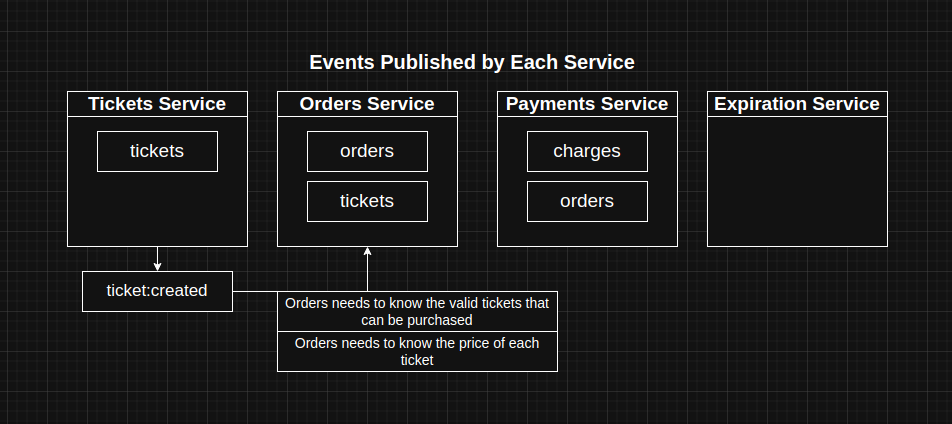
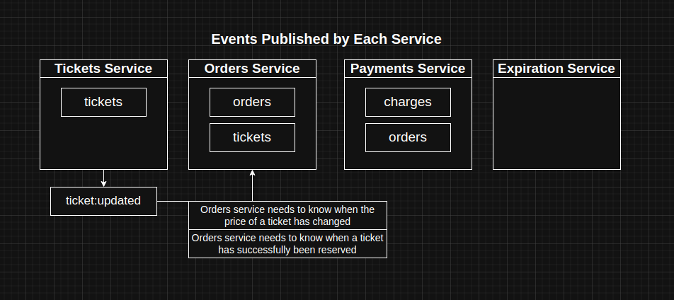
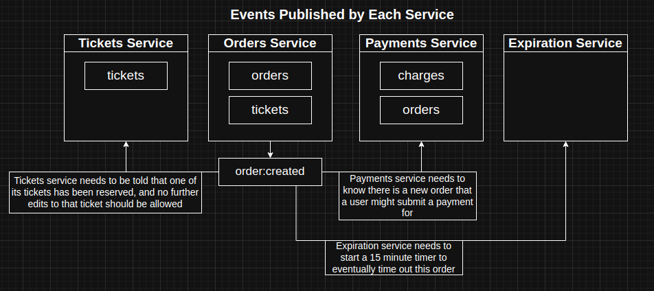
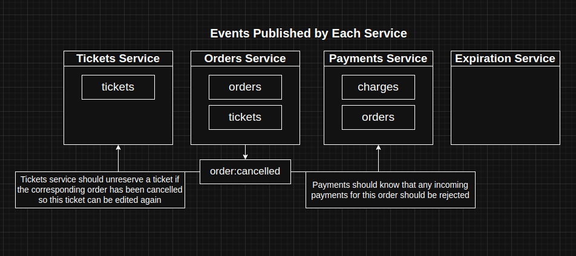
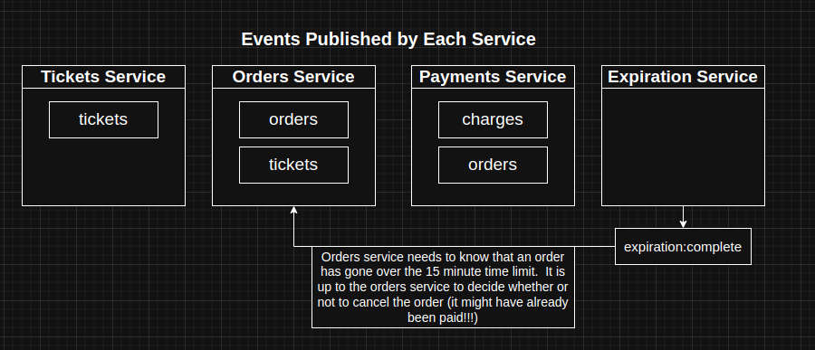
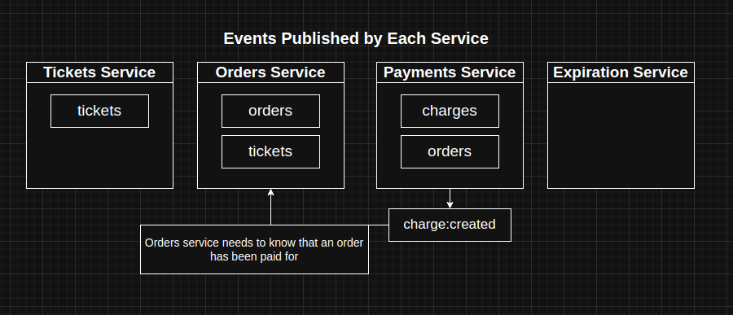

# 🎟️ Ticketing Microservices Backend

A full-featured microservices backend application that enables users to list and purchase tickets for events like concerts or sports matches. Built with scalability and fault-tolerance in mind, it uses event-driven architecture, service isolation, and robust testing and concurrency strategies.

## 📌 Features

* Users can list tickets for events
* Other users can purchase available tickets
* Tickets are locked for 15 minutes during the purchase flow
* Tickets can’t be edited while locked
* Orders expire after 15 minutes if not completed
* Payments are processed securely using Stripe
* Full testing coverage across services
* Concurrency control implemented to avoid race conditions

---
## 🧱 Microservices

| Service           | Responsibility                                                         |
| ----------------- | ---------------------------------------------------------------------- |
| **Auth**          | Handles user authentication (signup/signin/signout)                    |
| **Tickets**       | Handles ticket creation, updates, and listing                          |
| **Orders**        | Handles order creation, cancellation, and fetching                     |
| **Expiration**    | Watches for order expiration and cancels them after 15 minutes         |
| **Payments**      | Handles Stripe payment processing and updates order status accordingly |
---
### **Technology Stack**

| Category            | Technologies       |
|---------------------|--------------------|
| Language            | TypeScript         |
| Backend Framework   | Express.js         |
| Testing             | Jest               |
| Databases           | Redis, MongoDB     |
| DevOps              | Docker, Kubernetes |
| CI/CD               | CI/CD              |
| Messaging           | NATS               |

---

## 🧭 Routes Overview

### 🔐 Auth Service

| Route                    | Method | Body                                  | Purpose                          |
| ------------------------ | ------ | ------------------------------------- | -------------------------------- |
| `/api/users/signup`      | POST   | `{ email: string, password: string }` | Register a new user              |
| `/api/users/signin`      | POST   | `{ email: string, password: string }` | Authenticate an existing user    |
| `/api/users/signout`     | POST   | -                                     | Sign out the user                |
| `/api/users/currentuser` | GET    | -                                     | Fetch current authenticated user |

---

### 🎫 Tickets Service

| Route              | Method | Body                               | Purpose                        |
| ------------------ | ------ | ---------------------------------- | ------------------------------ |
| `/api/tickets`     | GET    | -                                  | Retrieve all available tickets |
| `/api/tickets/:id` | GET    | -                                  | Get a ticket by its ID         |
| `/api/tickets`     | POST   | `{ title: string, price: string }` | Create a new ticket            |
| `/api/tickets/:id` | PUT    | `{ title: string, price: string }` | Update an existing ticket      |

---

### 🧾 Orders Service

| Route             | Method | Body                   | Purpose                                 |
| ----------------- | ------ | ---------------------- | --------------------------------------- |
| `/api/orders`     | GET    | -                      | List active orders for the current user |
| `/api/orders/:id` | GET    | -                      | Get specific order details              |
| `/api/orders`     | POST   | `{ ticketId: string }` | Create an order for a ticket            |
| `/api/orders/:id` | DELETE | -                      | Cancel an existing order                |

---

### 💳 Payments Service

| Route           | Method | Body                                 | Purpose                      |
| --------------- | ------ | ------------------------------------ | ---------------------------- |
| `/api/payments` | POST   | `{ orderId: string, token: string }` | Process payment using Stripe |

---

## 🔁 Event-Driven Architecture

The system uses a **publish/subscribe** model with **NATS Streaming** to coordinate between services. Key domain events include:

* `TicketCreated`
* `TicketUpdated`
* `OrderCreated`
* `OrderCancelled`
* `ExpirationComplete`
* `PaymentCreated`

---

## ⏱ Concurrency Control

* Implemented **Optimistic Concurrency Control (OCC)** with versioning in the ticket service, and order service.
* Prevents race conditions when multiple updates or purchases are attempted concurrently.

---

## ✅ Testing

Each service contains:

* **Unit tests** for business logic
* **Integration tests** for route and DB interactions

Testing tools: `jest`, `supertest`, `mongodb-memory-server`

---

## 🚀 Deployment Workflow

### Development Setup

* **Tech stack**: Node.js, TypeScript, MongoDB, NATS, Stripe
* **Containerized** using Docker
* Managed using **Skaffold** for local Kubernetes development

### Production Deployment

* Services are deployed using **Docker** & **Kubernetes**
* Ingress controller with **NGINX** for routing
* Configuration managed with **Environment Variables** and **Secrets**

---

## 🌐 Ingress Routing

All services are accessible via a single domain:

```
/api/users/*       → auth service  
/api/tickets/*     → tickets service  
/api/orders/*      → orders service  
/api/payments/*    → payments service  
```
---
## 🔑 Environment Variables

`JWT_KEY` : string, JSON web token secret <string> (Example: JwtKey)

`STRIPE_KEY`: your stripe API key to handle the payment

---

## 📸 Events Flow

### <ins>ticket:created</ins>:


### <ins>ticket:updated</ins>:


### <ins>order:created</ins>:


### <ins>order:cancelled</ins>:


### <ins>expiration:completed</ins>:


### <ins>charge:created</ins>:


---

## 📌 Future Improvements

* Add email notifications for order status
* Introduce user profiles and ticket browsing filters
* Integrate real-time updates via WebSocket or SSE
* Add rate limiting and request tracing in production

---

## 🧑‍💻 Author

**Abdelrahman Mohamed**

